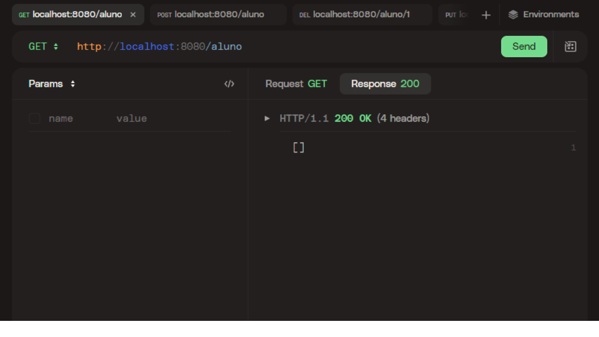
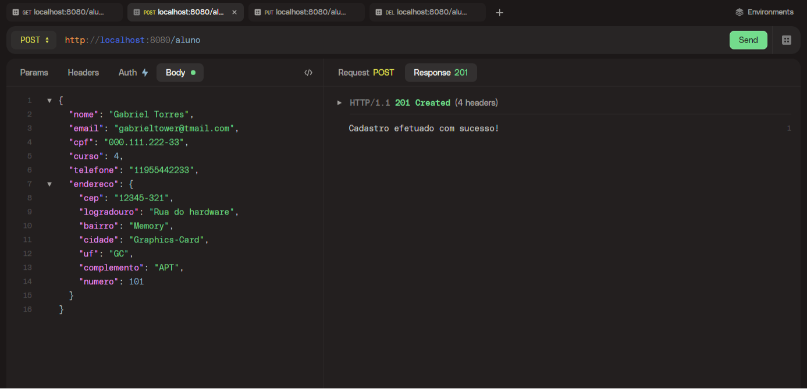
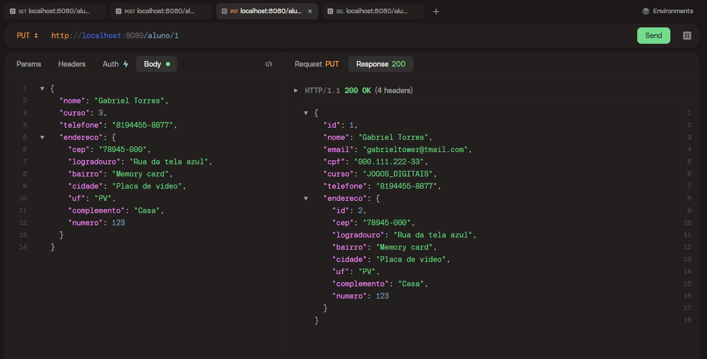
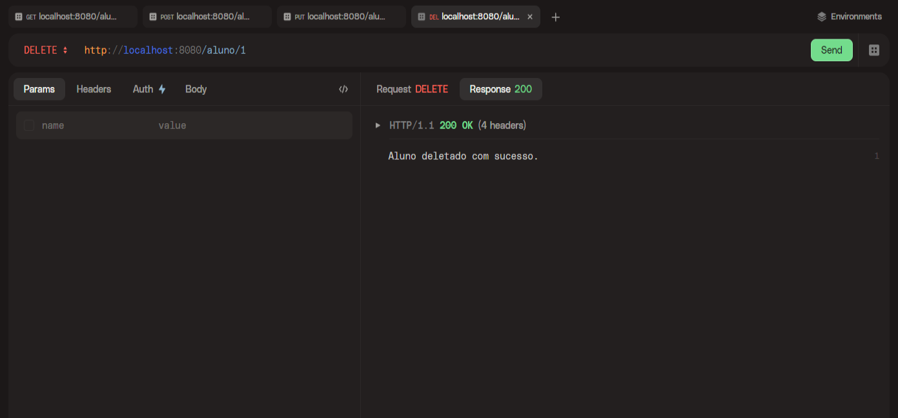

<h1 align="center">Projeto Scholar System<h1>

## Desafio final vai na web

O objetivo é construir uma API simples que responda com os códigos de status HTTP corretos para as requisições feitas pelo lado do usuário. Esses códigos de status são essenciais para comunicar o resultado das requisições, como sucesso, erro do cliente, erro do servidor, entre outros. Vamos focar em garantir que nossa API forneça respostas adequadas de acordo com cada situação, proporcionando uma experiência de usuário consistente e confiável.

### Neste desafio foi utilizado as tecnologias:

- Eclipse IDE
- HTTPie
- Linguagem Java
- Spring Framework
- MySql (h2)
- Trello

<h2 align="center">Iniciando o projeto</h2>

### Para iniciar o projeto basta clicar no botão run da sua IDE.

Para verificarmos se está funcionando, coloque a seguinte url no seu browser ou na sua api test client.

```
localhost://8080/aluno
```

Depois desse comando a api irá me trazer a quantidade de alunos através do método GET:



Como a nossa api está vazia, irei preencher com o primeiro aluno através do método POST:



Podemos também fazer alguma alteração no aluno utilizando o método PUT.
Alterando a url para fazer a alteração por id.

```
localhost://8080/aluno/1
```



Depois de nossa alteração ficará dessa maneira:


E por último iremos deletar nosso aluno do banco de dados através do DELETE:

